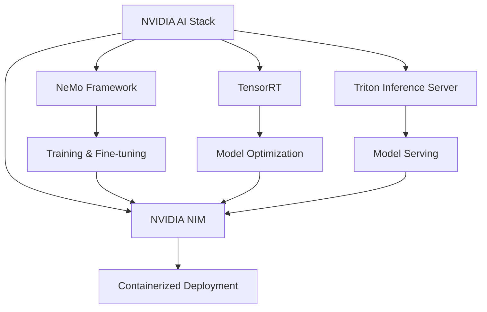

# Understanding NeMo Framework & NeMo 2 Format

## What is NVIDIA NeMo?

NVIDIA NeMo (Neural Modules) is a comprehensive framework ecosystem for building, training, and deploying large language models (LLMs) and other generative AI models. Let's clarify the different components:

### The NeMo Ecosystem

#### 1. **NeMo Framework (Core Library)**
The Python library you install and import:
```python
pip install nemo-toolkit
import nemo
```
- Provides high-level APIs for model training
- Built on PyTorch Lightning
- Includes pre-built model architectures
- Handles distributed training automatically

#### 2. **NeMo GitHub Repository**
What we cloned in the workshop:
```bash
git clone https://github.com/NVIDIA/NeMo.git
```
- Contains source code for the framework
- Includes example scripts (what we use for training)
- Has model implementations
- Provides utilities and tools

#### 3. **NeMo Models**
Pre-trained models available on NGC:
- Named with "nemo" suffix (e.g., `llama-3_2-1b-instruct-nemo`)
- Optimized for NVIDIA hardware
- Available in both old (.nemo) and new (.distcp) formats

#### 4. **NeMo Guardrails**
Separate product for AI safety:
```python
pip install nemoguardrails
```
- Adds safety layers to LLM applications
- Prevents harmful outputs
- Enforces topic boundaries
- Different from core NeMo Framework

#### 5. **NeMo Curator**
Data curation toolkit:
- Cleans and prepares training data
- Deduplicates datasets
- Filters low-quality content
- Essential for large-scale training

#### 6. **NeMo Aligner**
RLHF and alignment tools:
- Implements PPO, DPO, and other alignment methods
- Fine-tunes models based on human preferences
- Part of the broader NeMo ecosystem

### Why Both Library and Repository?

**Library Installation:**
```bash
pip install nemo-toolkit[all]  # Full installation
pip install nemo-toolkit[nlp]  # Just NLP components
```
- Good for using pre-built functionality
- Stable releases
- Easy dependency management

**GitHub Repository:**
```bash
git clone https://github.com/NVIDIA/NeMo.git
cd NeMo && pip install -e .
```
- Access to latest features
- Can modify source code
- Contains example scripts
- More flexibility for research

**In This Workshop:**
- We use the **GitHub repository** for training scripts
- We don't install the full library (takes 20-30 minutes)
- The scripts work with our existing PyTorch environment
- Production deployments would use the pip-installed version

### How NeMo Relates to Other NVIDIA Solutions



**The Flow:**
1. **Train** with NeMo Framework
2. **Optimize** with TensorRT
3. **Serve** with Triton
4. **Deploy** with NIM containers

### NeMo vs Other Frameworks Comparison Table

| Feature | NeMo | Hugging Face | PyTorch | DeepSpeed |
|---------|------|--------------|---------|-----------|
| **Focus** | End-to-end LLM platform | Model hub & training | General deep learning | Training optimization |
| **Distributed Training** | Built-in (Megatron-LM) | Requires setup | Manual implementation | Focus area |
| **Model Parallelism** | Automatic | Limited | Manual | Supported |
| **Production Path** | Direct (via NIM) | Multiple options | DIY | Training only |
| **NVIDIA Optimization** | Native | Generic | Generic | Generic |
| **Pre-trained Models** | NGC catalog | HF Hub | Few | None |

### Common Confusion Points

**Q: Is NeMo just for NVIDIA GPUs?**
A: Optimized for NVIDIA hardware but can run on CPUs/other GPUs with reduced performance.

**Q: Do I need NeMo to use NIMs?**
A: No! NIMs can serve any compatible model format. NeMo just provides the easiest path.

**Q: Why not just use Hugging Face?**
A: You can! But NeMo offers:
- Better performance on NVIDIA hardware
- Easier scaling to multiple GPUs
- Direct deployment path
- Optimized training techniques

### When to Use Which Component

#### **Use NeMo Framework when:**
- Training large models (>1B parameters)
- Need distributed training across multiple GPUs
- Want optimized performance on NVIDIA hardware
- Building production LLM pipelines
- Need model parallelism (tensor/pipeline)

#### **Use NeMo Guardrails when:**
- Deploying LLMs in production
- Need to enforce safety boundaries
- Want to prevent harmful/off-topic responses
- Building customer-facing applications
- Compliance requirements (GDPR, HIPAA)

#### **Use NeMo Curator when:**
- Preparing large-scale training data
- Need to deduplicate datasets
- Want to filter low-quality content
- Building custom datasets from web scrapes
- Preprocessing multilingual data

#### **Use NeMo Aligner when:**
- Implementing RLHF (Reinforcement Learning from Human Feedback)
- Fine-tuning with human preferences
- Need DPO (Direct Preference Optimization)
- Building instruction-following models
- Improving model helpfulness/harmlessness

### Real-World Use Cases

**Enterprise Customer Service Bot:**
```
1. NeMo Curator → Clean support ticket data
2. NeMo Framework → Fine-tune Llama with LoRA
3. NeMo Guardrails → Add safety boundaries
4. NVIDIA NIM → Deploy to production
```

**Research Lab Training Custom Model:**
```
1. NeMo Curator → Process research papers
2. NeMo Framework → Pre-train from scratch
3. NeMo Aligner → RLHF with expert feedback
4. Export → Publish model weights
```

**Startup Building AI Product:**
```
1. Download pre-trained NeMo model
2. NeMo Framework → LoRA fine-tuning
3. NeMo Guardrails → Topic boundaries
4. NVIDIA NIM → Quick deployment
```

---

## NeMo 2 Distributed Checkpoint Format

Now that we understand the NeMo ecosystem, let's dive into the specific checkpoint format used by NeMo 2...

## What is NeMo 2 Format?

The NeMo 2 distributed checkpoint format is NVIDIA's newer, more efficient way of storing large language models. Unlike the older single-file format, it splits models into manageable shards for better performance and scalability.

### Format Comparison

**Old Format (NeMo 1):**
```
model.nemo  (single file, e.g., 15GB)
```

**New Format (NeMo 2):**
```
llama-3_2-1b-instruct_v2.0/
├── context/
│   ├── model.yaml         # Model architecture config
│   ├── io.json           # I/O configuration
│   └── nemo_tokenizer/   # Tokenizer files
└── weights/
    ├── .metadata         # Checkpoint metadata
    ├── __0_0.distcp     # Model weights shard 1
    ├── __0_1.distcp     # Model weights shard 2
    └── common.pt        # Shared parameters
```

## Why the Change?

### 1. **Distributed Training Support**
- Modern models (70B, 175B parameters) can't fit on single GPUs
- Natural support for model parallelism
- Each GPU loads only its portion of the model

### 2. **Faster Loading**
- Parallel loading of different shards
- No need to load entire model then redistribute
- Reduced memory pressure during initialization

### 3. **Efficient Storage**
- Better compression algorithms
- Deduplication of repeated weights
- Easier incremental updates

## Real-World Example

For Llama 3.2 1B model:
```
weights/
├── __0_0.distcp    # 1.2GB - First shard (layers 0-15)
├── __0_1.distcp    # 1.2GB - Second shard (layers 16-31)
├── common.pt       # 2.8KB - Shared weights (embeddings, etc.)
└── metadata.json   # Shard loading configuration
```

## Key Advantages

### Training on Multiple GPUs
```python
# Old way: Load entire model, then split
model = load_model("model.nemo")  # 15GB on GPU 0
model = split_for_gpus(model)     # Complex redistribution!

# New way: Each GPU loads its shard directly
gpu0.load("__0_0.distcp")  # 1.2GB
gpu1.load("__0_1.distcp")  # 1.2GB
```

### LoRA Integration
- LoRA adapters seamlessly add to existing shards
- No need to merge into monolithic file
- Dynamic adapter swapping at runtime

---

## Frequently Asked Questions

### NeMo Ecosystem Questions

**Q: What does "NeMo" stand for?**
A: Neural Modules - representing the modular approach to building neural networks. Each component (attention, FFN, embeddings) is a module that can be composed together.

**Q: Which NVIDIA products use "NeMo" in their name?**
A: Several products in the ecosystem:
- **NeMo Framework** - Core training/inference library
- **NeMo Guardrails** - AI safety toolkit
- **NeMo Curator** - Data preparation tools
- **NeMo Aligner** - RLHF/alignment tools
- **NeMo Models** - Pre-trained models on NGC (suffix -nemo)

**Q: Do I need to install all NeMo components?**
A: No! They're modular:
```bash
# Just core framework
pip install nemo-toolkit

# With specific domains
pip install nemo-toolkit[nlp]    # Just NLP
pip install nemo-toolkit[asr]    # Just speech
pip install nemo-toolkit[all]    # Everything

# Separate products
pip install nemoguardrails       # Safety (separate)
```

**Q: What's the difference between nemo-toolkit and the GitHub repo?**
A: 
- **nemo-toolkit (pip)**: Stable releases, tested dependencies, production use
- **GitHub repo**: Latest features, examples, development, can modify code

In practice:
```python
# Production deployment
pip install nemo-toolkit==1.23.0  # Specific version

# Research/development
git clone https://github.com/NVIDIA/NeMo.git
cd NeMo && pip install -e .  # Editable install
```

**Q: Can I use NeMo models without NeMo Framework?**
A: Yes, but with limitations:
- Can export to ONNX/TensorRT
- Can convert to Hugging Face format
- But lose optimizations and features
- NIM containers work best with native NeMo format

**Q: Is NeMo only for LLMs?**
A: No! NeMo supports multiple domains:
- **NLP**: LLMs, BERT, machine translation
- **Speech**: ASR, TTS, speaker recognition  
- **Vision**: Vision transformers, CLIP
- **Multimodal**: Vision-language models
- **Audio**: Speech enhancement, voice conversion

**Q: How does NeMo relate to Megatron-LM?**
A: NeMo uses Megatron-LM as its backend for large model training:
- Megatron-LM: Low-level distributed training
- NeMo: High-level APIs and tooling
- Think of Megatron as the engine, NeMo as the car

**Q: What's the learning curve for NeMo?**
A: Depends on your use case:
- **Using pre-trained models**: Easy (1-2 days)
- **Fine-tuning with LoRA**: Moderate (1 week)
- **Training from scratch**: Advanced (2-4 weeks)
- **Custom architectures**: Expert (1+ months)

### Basic Usage

**Q: Do I need to change my code for NeMo 2 format?**
A: No! NeMo handles it automatically. Just point to the directory instead of a .nemo file:
```python
# Old: model_path = "model.nemo"
# New: model_path = "model_directory/"
```

**Q: Can I convert between formats?**
A: Yes, but the distributed format is superior for most use cases. Conversion tools are available if needed.

**Q: What if I only have 1 GPU?**
A: No problem! NeMo automatically loads all shards onto your single GPU. The format still provides benefits like faster loading.

### NeMo vs Other Frameworks

**Q: Why use NeMo instead of Hugging Face Transformers?**
A: Several key advantages:
- **Scale**: NeMo is built for massive models (up to 1T parameters)
- **Performance**: Optimized for NVIDIA GPUs with Megatron-LM backend
- **Production**: Direct path to deployment with NIM containers
- **Features**: Built-in support for model parallelism, RLHF, and advanced training techniques

**Q: How does NeMo compare to DeepSpeed?**
A: 
- **NeMo**: Full framework with models, training, and deployment
- **DeepSpeed**: Primarily an optimization library
- NeMo actually uses DeepSpeed's ZeRO optimizer when beneficial
- Choose NeMo for end-to-end LLM workflows

**Q: What about PyTorch Lightning?**
A: NeMo is built on PyTorch Lightning! You get:
- All Lightning benefits (logging, checkpointing, etc.)
- Plus LLM-specific optimizations
- Plus deployment pathways

**Q: Can I use NeMo models with vLLM/TGI/other serving frameworks?**
A: Yes, but you lose optimizations:
- NIM containers are purpose-built for NeMo models
- Alternative: Export to ONNX/TensorRT, but NIM is easier

### Technical Details

**Q: What are .distcp files exactly?**
A: Distributed checkpoint files containing:
- Model weight tensors for specific layers
- Metadata about tensor placement
- Optimization states (if saved during training)

**Q: How does sharding work for different model sizes?**
A: 
- 1B model: 2-4 shards
- 7B model: 8-16 shards  
- 70B model: 70-140 shards
- Sharding is automatic based on model config

**Q: Can I load specific layers only?**
A: Yes! This enables:
- Layer-wise fine-tuning
- Memory-efficient inference
- Debugging specific components

### Performance & Optimization

**Q: Is the distributed format slower?**
A: Actually faster!
- Parallel I/O for loading
- Better CPU-GPU memory transfer patterns
- Optimized for NVMe SSDs

**Q: How much disk space do I need?**
A: Similar to single-file format:
- Model weights: ~2GB per billion parameters
- Checkpoints during training: 3-4x model size
- LoRA adapters: ~10-100MB each

**Q: Memory requirements during training?**
A: With NeMo 2 + LoRA:
- Base model (frozen): 2 bytes per parameter
- LoRA adapters: ~1% of base model
- Optimizer states: 8 bytes per trainable parameter
- Example: 7B model + LoRA needs ~16GB GPU memory

### Deployment Questions

**Q: Do NIM containers support both formats?**
A: Yes! NIM automatically detects and handles both:
- Single .nemo files (legacy)
- Distributed checkpoints (recommended)
- LoRA adapters (either format)

**Q: How do I serve multiple LoRA adapters?**
A: NeMo 2 format makes this easy:
- Base model loads once
- LoRA adapters load/unload dynamically
- Each request can use different adapters

**Q: Production best practices?**
A: 
1. Use distributed format for models >1B parameters
2. Store on fast NVMe SSDs
3. Enable checkpoint caching in NIM
4. Monitor shard loading times

### Troubleshooting

**Q: "Model not found" error with correct path?**
A: Check you're pointing to the directory, not a file:
```bash
# Wrong: MODEL="path/to/model.nemo"
# Right: MODEL="path/to/model_directory/"
```

**Q: How do I verify checkpoint integrity?**
A: 
```bash
# Check all shards exist
ls -la model_dir/weights/*.distcp

# Verify metadata
cat model_dir/weights/metadata.json
```

**Q: Can I mix checkpoint versions?**
A: No! All shards must be from the same checkpoint. The metadata.json ensures version consistency.

### Advanced Topics

**Q: How does this relate to tensor parallelism?**
A: Perfect alignment!
- Shards map to tensor parallel ranks
- No redistribution needed during training
- Automatic optimization for multi-GPU

**Q: What about pipeline parallelism?**
A: Also supported:
- Shards can represent pipeline stages
- Flexible mapping to GPU topology
- Configured in model.yaml

**Q: Custom sharding strategies?**
A: Yes, for researchers:
- Override default sharding in config
- Custom shard-to-GPU mapping
- Layer-wise optimization strategies

## Summary

The NeMo 2 distributed checkpoint format represents a significant advancement in handling large language models. It provides:

- ✅ Better scalability for massive models
- ✅ Faster loading and training startup
- ✅ Natural integration with model parallelism
- ✅ Seamless LoRA adapter support
- ✅ Production-ready deployment path

Whether you're training on a single GPU or a massive cluster, the distributed format offers advantages in flexibility, performance, and ease of use. Combined with NIM for deployment, it provides a complete path from research to production.

## Additional Resources

- [NeMo Documentation](https://docs.nvidia.com/nemo-framework/user-guide/latest/index.html)
- [Megatron-LM Paper](https://arxiv.org/abs/1909.08053)
- [NIM Container Documentation](https://docs.nvidia.com/nim/)
- [Model Parallelism Strategies](https://pytorch.org/tutorials/intermediate/model_parallel_tutorial.html)
- [NeMo Guardrails](https://github.com/NVIDIA/NeMo-Guardrails)
- [NeMo Curator](https://github.com/NVIDIA/NeMo-Curator) 